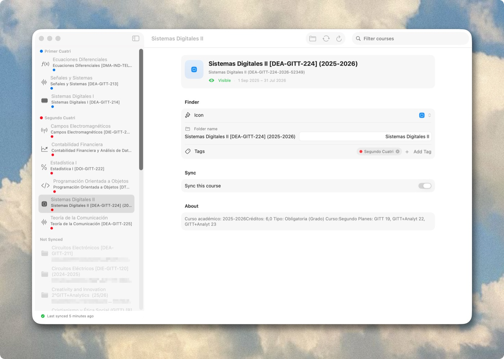
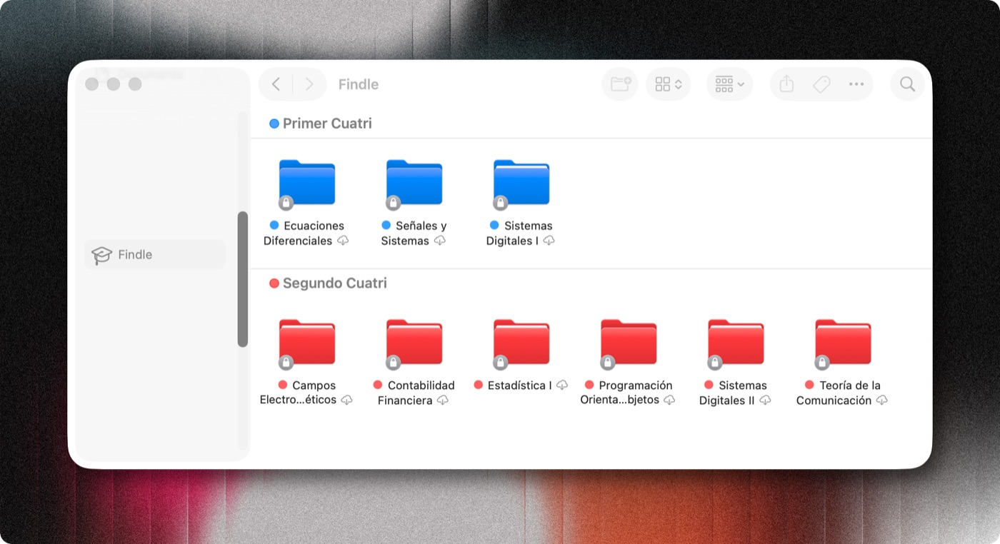
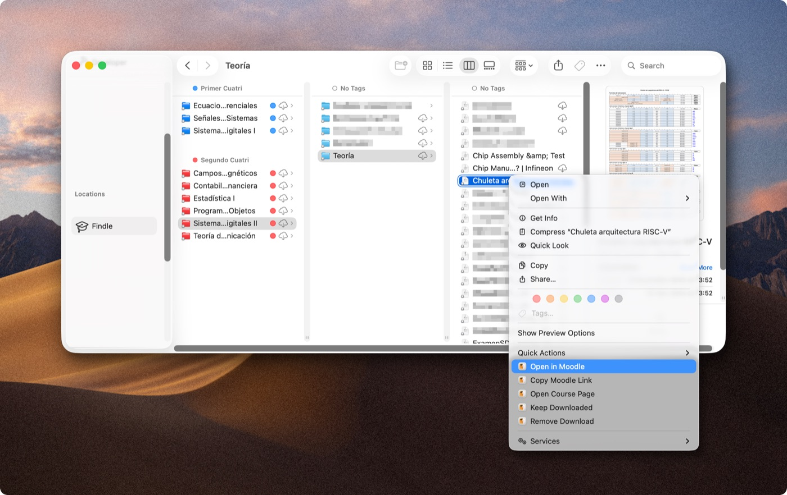
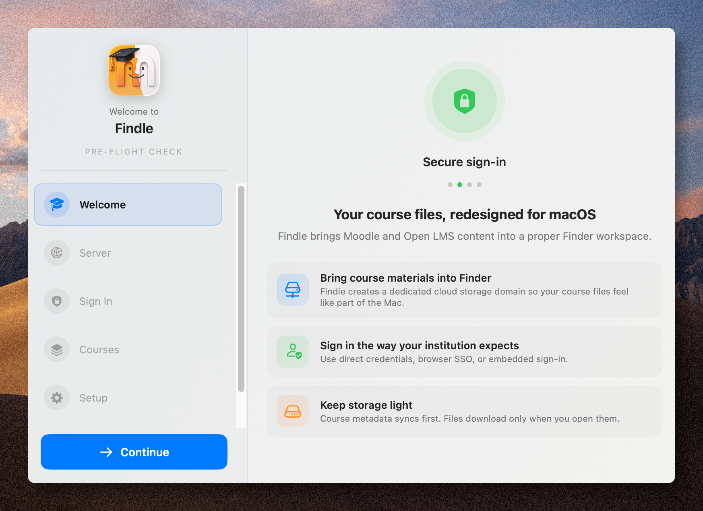
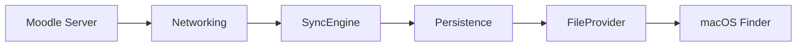

<p align="center">
  
</p>

<h1 align="center">Findle</h1>

<p align="center">
  <b>A native macOS app that syncs Moodle and Open LMS course content directly to your Mac using Apple's File Provider framework.</b>
</p>

<p align="center">
  <a href="https://apple.com/macos"></a>
  <a href="https://swift.org"></a>
  <a href="https://github.com/alexmodrono/Findle/actions"></a>
  <a href="LICENSE"></a>
  <a href="http://makeapullrequest.com"></a>
</p>

<p align="center">
  <em>Your course files right in Finder, behaving exactly like iCloud Drive or Dropbox.</em>
</p>

---

## Overview

Findle is built to make managing university or school materials painless. Instead of constantly logging into Moodle to download PDFs and slides, Findle seamlessly integrates your courses right into macOS Finder. It's built from the ground up in Swift and SwiftUI, leveraging Apple's native File Provider framework to ensure your files are synced securely, dynamically, and entirely on-demand.

https://github.com/user-attachments/assets/7257c605-1fb9-45e1-ae41-f9e7dade8365

## Screenshots

<div align="center">
  
  
  <br/>
  <em>Browse your courses, toggle sync preferences, and monitor progress directly from the native macOS interface.</em>
</div>

<br/>

| Direct Finder integration | Quick Actions without Leaving Finder |
| :---: | :---: |
|  |  |
| Findle seamlessly integrating with Finder's sidebar, behaving exactly like iCloud Drive or Dropbox. | Perform quick actions directly from the Finder app, no need to open any browser. |
|  |  |
| Connect to your Moodle server and authenticate securely. | Simple and beautiful onboarding steps thanks to [alexmodrono/Airlock](https://github.com/alexmodrono/Airlock). |

## Features

- **Native macOS Experience:** Built specifically for the Mac using Swift and SwiftUI, so it feels fast and right at home.
- **File Provider Integration:** First-class Finder sidebar presence. Files only download when you actually need them, saving local disk space.
- **Secure by Default:** Authentication happens via the official Moodle Web Services API, and credentials are stored securely in the macOS Keychain.
- **Smart Sync:** The app handles automatic course discovery, enumerates content, and performs incremental syncs using per-course change tracking.
- **Automatic Updates:** Built-in update checking via Sparkle, so you always have the latest version.
- **Efficient Storage:** Under the hood, a local SQLite database caches metadata so you can browse your course structure instantly, using placeholder files until you double-click them.

## Installation

### Download

Download the latest `.dmg` from the [Releases](https://github.com/alexmodrono/Findle/releases/latest) page. Open the disk image and drag Findle to your Applications folder.

### Homebrew

```bash
brew tap alexmodrono/tap
brew install --cask findle
```

## Building from Source

### Requirements

- macOS 14.0 (Sonoma) or later
- Xcode 16.0 or later
- Swift 6.0
- [XcodeGen](https://github.com/yonaskolb/XcodeGen) (for generating the Xcode project)

### Steps

1. **Install XcodeGen** (if you haven't already):
   ```bash
   brew install xcodegen
   ```

2. **Generate the Xcode project:**
   ```bash
   xcodegen generate
   ```

3. **Open the project:**
   ```bash
   open Foodle.xcodeproj
   ```

4. **Configure Code Signing:**
   The File Provider extension requires code signing with a valid Apple Development Team. Go into the Xcode project settings and select your own Development Team for all targets before building.

5. Select the `Foodle` scheme, build, and run.

> **Note:** The Xcode project and scheme are named `Foodle` for historical reasons, but the built app is called **Findle**.

### Staging Validation

Before shipping, use the Release-like `Foodle-Staging` scheme. It keeps optimization and hardened runtime behavior close to Release while still allowing tests to run.

```bash
xcodegen generate
./scripts/staging-smoke-test.sh
```

That script builds an unsigned optimized app in `Staging` and runs the test suite against it. It is the fast validation pass for optimized code paths, but it is not suitable for File Provider registration or end-to-end SSO/Finder checks because the extension is not code signed in that flow.

For real pre-ship runtime validation, build a signed Staging app:

```bash
xcodegen generate
./scripts/staging-signed-build.sh
```

If your project does not already have a team selected in Xcode, provide one from the shell:

```bash
DEVELOPMENT_TEAM=ABCDE12345 ./scripts/staging-signed-build.sh
```

Use the signed Staging app for the manual checklist: SSO completion, Finder integration, restart/session restore, sync, and file materialization.

## Architecture

Findle is split into a modular set of frameworks and targets. This keeps the separation of concerns clean and makes it easier to work on isolated features.

| Module | Purpose |
|--------|---------|
| `SharedDomain` | Core types, models, state machines, and shared error handling. |
| `FoodleNetworking` | The Moodle API client, authentication logic, and Keychain integration. |
| `FoodlePersistence` | The SQLite database layer, metadata cache, and sync cursors. |
| `FoodleSyncEngine` | Orchestrates the sync process, computes diffs, and manages downloads. |
| `FoodleFileProvider`| The Apple File Provider extension that hooks directly into Finder. |
| `Findle` (App) | The main SwiftUI app shell, handling onboarding, diagnostics, and settings. |

### Data Flow Overview


## Testing

Reliability is maintained with unit and integration tests. You can run the test suites directly in Xcode using `Cmd+U`, or via the command line:

```bash
xcodebuild test -project Foodle.xcodeproj -scheme SharedDomainTests
xcodebuild test -project Foodle.xcodeproj -scheme PersistenceTests
```

Mock API responses and test fixtures can be found in the `Fixtures/` directory.

## Project Structure

```text
Findle/
├── Sources/
│   ├── App/                    # Main macOS application
│   ├── SharedDomain/           # Shared models and types
│   ├── Networking/             # Moodle API client
│   ├── Persistence/            # SQLite database
│   ├── SyncEngine/             # Sync orchestration
│   └── FileProviderExtension/  # Apple File Provider extension
├── Tests/                      # Unit and integration tests
├── Fixtures/                   # Mock API response data
├── Resources/                  # Plists, entitlements, and XCAssets
└── project.yml                 # XcodeGen project definition
```

## Roadmap

There's still a lot to be done. Here is what is currently on the radar:

- [x] Complete the end-to-end vertical slice (authenticate -> enumerate -> Finder placeholders)
- [ ] Background sync refresh
- [x] Offline pinning support
- [ ] Multi-account support
- [ ] Optional offline mirror to a user-chosen folder
- [x] Spotlight integration
- [ ] Assignment submission support directly from the Mac
- [ ] Support for additional LMS backends

## Contributing

Contributions are always welcome! If you have an idea to improve Findle or fix a bug:

1. Fork the repository
2. Create your feature branch (`git checkout -b feature/AmazingFeature`)
3. Commit your changes (`git commit -m 'Add some AmazingFeature'`)
4. Push to the branch (`git push origin feature/AmazingFeature`)
5. Open a Pull Request for review.

## License

This project is licensed under the Apache License 2.0. See the [LICENSE](LICENSE) file for the full details.
