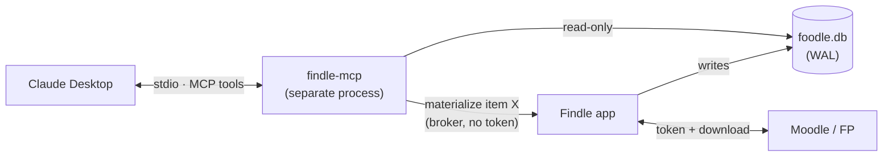

# Findle MCP Server + Semantic Search — Design (v3)
Lets LLM agents (Claude Desktop, etc.) query a student's synced Moodle coursework without manual uploads, by exposing Findle's existing data through a local MCP server, with on-device semantic search and read-only coursework tracking (deadlines, submission status, grades).

> **v3 changes:** semantic/embedding search promoted from "only if needed" to a committed deliverable (FTS5 stays as its foundation, not an alternative — see §Retrieval). New read-only tracking layer for assignments, quizzes, and grades. Submitting work and taking quizzes remain explicitly out of scope.
## Goal
Turn the pile of synced Moodle files into something you can _talk to_: ask questions across all courses, find material by meaning, and get study help grounded in your own files — without downloading everything or hunting through folders.
## Scope (v1)
- **Local desktop MCP clients** (Claude Desktop) over **stdio**.
  
- No web-client / public-tunnel support in v1. Making it reachable from web chat clients is a desirable future extension but is out of scope for now (it would require exposing the server publicly: tunnel + auth + a privacy hit).
  
- **Read-only coursework tracking is in scope**: deadlines, submission status, grades, feedback, quiz attempts/scores (see §Submissions, quizzes & grades). This is metadata the agent can reason over for study planning — it never touches files.
  
- **Writing to Moodle is explicitly out of scope**: no submitting assignments, no taking/answering quizzes. The app has no write path to Moodle today and this design keeps it that way. Rationale: submit-for-grading is irreversible, the APIs are fiddly and often server-disabled, and exposing graded-work actions through an agent boundary crosses into academic-integrity territory. If ever revisited, it must be a separate, human-in-the-loop track — never an autonomous MCP tool.
  
## Architecture

- The MCP server is a **separate process** that opens the shared App Group database **read-only** (`SQLITE_OPEN_READONLY`).
  
- It is a **third reader** on the same WAL database the app and File Provider extension use. The existing `busy_timeout(5000)` + `SQLITE_TRANSIENT` work makes the extra reader safe; read-only access avoids write contention entirely.
  
- The **Findle app is the single writer** — it builds the FTS and embedding indexes during sync. The MCP server never writes.
  
- **Downloads use a broker pattern** (see below): the MCP server never holds the Moodle token.
  
## Retrieval layers (phased)
### Phase 1 — Catalog (exact, structural)
Direct queries over the existing `items` / `courses` tables: what exists, which course/section, Moodle URL, tags, sync state. Exact and essentially free.
### Phase 2 — Full-text search (FTS5) — _foundation, ships first_
An SQLite FTS5 virtual table over extracted text + filenames + course names; exact keyword/phrase search. FTS5 is **not an alternative to embeddings — it is their prerequisite**: both layers consume the same extracted-text cache, so building FTS first delivers value in days and lays the extraction pipeline the vector layer reuses. Catalog + FTS handles exact/keyword recall; the vector layer (Phase 3) handles concept recall.
### Phase 3 — Semantic / vector search — _committed deliverable_
On-device embeddings for concept-level recall ("find everything about dynamic programming") that keyword search structurally misses. Promoted from optional (v2) to committed because the target workflows — cross-course study plans, condensed notes, theory Q&A — depend on connecting a query to material that never shares its vocabulary (e.g. "gradient descent" → a slide titled "optimization methods"). FTS cannot bridge that; this is the layer that makes the corpus _talk-to-able_. Sequenced after FTS, but planned for from the start.
## MCP tool surface
Read-first. Anything that materializes content goes through the broker.

| Tool | Purpose | Notes |
| --- | --- | --- |
| `list_courses()` | Courses + sync state + tags | catalog |
| `search_items(query, course?, tag?, since?, limit?)` | Metadata + keyword matches | catalog + FTS5 |
| `get_item(id)` | Full metadata, Moodle URL, local availability | catalog |
| `read_item(id)` | Extracted text of one file | cache; broker-materializes if missing |
| `semantic_search(query, course?, k?)` | Concept search → chunks + source items | Phase 3 |
| `get_moodle_url(id)` | Canonical Moodle deep link | catalog |
| `materialize_item(id)` / `trigger_sync(course?)` | Cause a download/sync | broker → app |
| `list_deadlines(course?, within?)` | Upcoming assignment/quiz due dates + submission state | tracking |
| `get_submission_status(assignment_id)` | Submitted / late / graded, grade, feedback text | tracking |
| `get_grades(course?)` | Grade items + scores + feedback | tracking |
| `get_quiz_attempts(quiz_id)` | Past attempts, scores, open/closed windows | tracking |

All tracking tools are **read-only** — there is deliberately no `submit_*` or `answer_quiz` tool (see §Scope).
## Downloads: the broker pattern
The MCP server **never holds the Moodle token**. When it needs content that isn't already local, it asks the Findle app (which already has keychain access) to materialize the item, then reads the result from the cache / File Provider.

- The token stays in the app process — it never enters the MCP process or the LLM client.
  
- Caveat: _something_ must still present the token to Moodle over TLS to download at all (it goes in the POST body, per the recent token-handling change). The broker doesn't make the token vanish; it keeps it out of the agent boundary, which is the exposure that matters.
  
- IPC options for the broker: XPC, a Unix domain socket, or a loopback endpoint the app exposes. (Mechanism TBD at implementation time.)
  
## Submissions, quizzes & grades (read-only tracking)
A study planner is far more useful when it knows _what's due_ and _how you did_ — not just what files exist. This layer surfaces coursework state so the agent can prioritise ("what should I study this week?"), close the loop on feedback ("incorporate the professor's comments on assignment 2"), and ground revision in actual results.

**Grounding:** the app is read-only today (`LMSProvider` fetches courses/contents and downloads files — `LMSProvider.swift`). `ResourceType` already names `.assignment` and `.quiz` (`MoodleResource.swift`) but nothing reads their state. This layer adds **read-only** Moodle Web Service calls; it introduces no write path.
### Moodle WS functions (all read-only)
- `mod_assign_get_assignments` — assignment list + due dates per course
  
- `mod_assign_get_submission_status` — submitted/late/graded, grade, feedback
  
- `mod_quiz_get_quizzes_by_courses` — quiz list + open/close windows
  
- `mod_quiz_get_user_attempts` — past attempts + scores
  
- `gradereport_user_get_grade_items` — grade items, scores, feedback
  

These are availability-gated per site (institutions can disable WS functions); the layer degrades gracefully — a missing function means that signal is simply absent, not an error.
### Where it runs
Tracking metadata is fetched during the **existing sync pass** (the app is already the sole writer, already authenticated) and cached in new tables. The MCP server reads those tables like any other catalog data — no new IPC, no new token exposure. Deadlines/grades refresh on the normal sync cadence.
### Data model additions (tracking)
- `assignments(id, course_id, name, due_date, cutoff_date, submission_state, grade, feedback_text, updated_at)`
  
- `quizzes(id, course_id, name, open_date, close_date, time_limit, updated_at)`
  
- `quiz_attempts(id, quiz_id, attempt_number, state, score, started_at, finished_at)`
  
- `grade_items(id, course_id, item_name, grade, max_grade, feedback_text, updated_at)`
  
## Vector pipeline (Phase 3 detail)
1. **Extraction** — the real work. PDF via PDFKit (the bulk of Moodle content); DOCX/PPTX/HTML need parsers; scanned PDFs need OCR via Vision (the genuine complication). Extracted text is cached in the DB.
  
2. **Chunking** — overlapping passages (~512 tokens).
  
3. **Embedding** — keep the app lightweight: **do not bundle** a model.
  

- Prototype with Apple's `NLEmbedding` first (zero footprint) to validate the feature is wanted. Weaker recall, but free.
  
- If quality demands it, **lazy-download** a small quantized multilingual model (Spanish + English) only when the user opts into semantic search. Reference sizes: monolingual MiniLM-L6 ≈ 25-45MB; multilingual L12 ≈ 120MB+ quantized. These open models (HuggingFace: MiniLM/e5/BGE) run fully on-device — inference is inherently private, nothing leaves the machine.
  

4. **Storage** — vectors as BLOBs in SQLite, **brute-force exact cosine** in Swift via Accelerate/SIMD. At this scale (~1k-20k vectors for one student) this is sub-millisecond with zero extra dependencies. A standalone vector DB (Pinecone/Qdrant/etc.) is over-engineering — its approximate (ANN) indexes only pay off at ~100k-1M+ vectors. `sqlite-vec` (a SQLite extension, not a server) is the upgrade path if ergonomics or scale ever warrant it.
  
5. **Incremental reindex** — re-embed only chunks whose `content_version` changed on sync. The field already exists, so no full rebuilds.
  

The materialization tradeoff: building the index requires downloading + extracting each file **once**. After that, queries are cheap and never re-touch Moodle. Embedding front-loads materialization rather than avoiding it.
## Data model additions
- `item_text(item_id, text, extracted_at, content_version)` — extracted-text cache.
  
- `items_fts` — FTS5 virtual table over `item_text.text` + filename + course name.
  
- `embeddings(item_id, chunk_index, chunk_text, vector BLOB, content_version)`.
  
## Concurrency & safety
- MCP opens the DB **read-only**; the app remains the single writer.
  
- WAL + `busy_timeout(5000)` (already in place) handle the extra reader.
  
- No new write paths means no new transaction/rollback surface in the hot path.
  
## Security
- **stdio, local-only** — no network listener, nothing exposed.
  
- The broker pattern keeps the Moodle token in the app process, out of the MCP process and the LLM client.
  
- Extracted text and embeddings derive from content already on disk — no new data egress.
  
## Milestones
1. **M1** — MCP scaffold + read-only DB access + Phase 1 catalog tools.
  
2. **M2** — PDF text extraction + `item_text` cache + FTS5 + `read_item` / `search_items` + the broker for materialization.
  
3. **M3** — Read-only tracking: sync-time fetch of assignments/quizzes/grades + cache tables + `list_deadlines` / `get_submission_status` / `get_grades` / `get_quiz_attempts`. Independent of M2/M4 — can land in parallel.
  
4. **M4** — Embedding pipeline (`NLEmbedding` prototype → opt-in lazy-downloaded model) + brute-force `semantic_search`. Committed deliverable; sequenced after M2 because it reuses the extraction cache.
  
## Decisions log
| #   | Decision | Rationale |
| --- | --- | --- |
| D1  | Desktop-only (stdio) for v1; web clients later | Web access needs public exposure + auth; conflicts with on-device design |
| D2  | App is sole writer; MCP read-only | Single writer avoids contention; simplest correctness story |
| D3  | Embeddings committed; FTS5 first as their foundation | Target workflows need concept recall FTS can't give; FTS still ships first since both share the extraction cache _(revised in v3 from "vectors only if needed")_ |
| D7  | Coursework tracking is read-only; no write path to Moodle | Submit-for-grading is irreversible; agent-driven graded work is an integrity hazard; keeps the app's read-only invariant |
| D8  | Tracking fetched during existing sync, cached, served like catalog | Reuses the sole-writer + auth the app already has; no new IPC or token exposure for the MCP |
| D4  | Downloads via broker (token stays in app) | MCP/agent never sees the token; only real exposure that matters |
| D5  | Don't bundle a model; NLEmbedding first, lazy-download on opt-in | Keeps base app lightweight; opt-in users pay the MB |
| D6  | Brute-force cosine over SQLite BLOBs; sqlite-vec as upgrade | Vector DB is over-engineering at ~1k-20k vectors |
